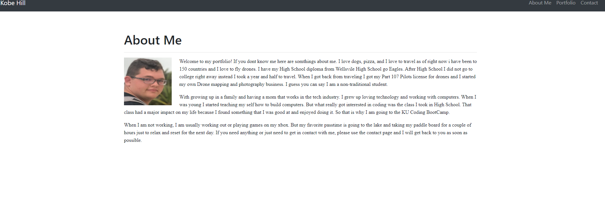
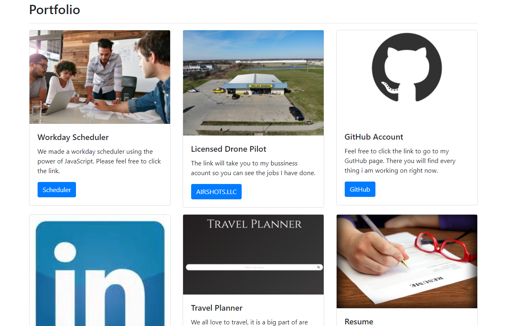
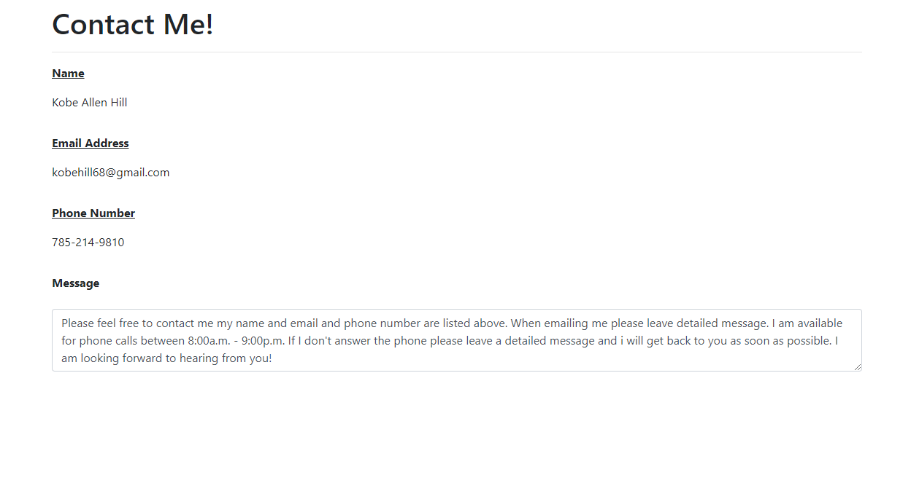

# 02_Responsive_Portfolio

# The Project Goal

The goal for this project was to make a Responsive Portfolio page utilizing the Bootstrap CSS Framework so the page would be usable on a variety of decives and screen sizes. The end result or solution was for us to have a index.html page a portfolio.html page and a contact.html page and all three pages had to link to each other, and all three pages had to be repsonsive. I learned from this project that using bootstrap may be fun and easy you are limted to bootstrap and there predefined CSS styles.

## Link To the Live Webpage
 https://kobehill68.github.io/02_Responsive_Portfolio/

## About Page Goal

For this page I wrote a breif but imformative description about my self and put in a portiat of myself. Then I made sure that the page was responsive and that the text would wrap around the image when the screen was smaller. 

## Portfolio Page Goal

In this page you will find the links to my projects and my proffesional socail media. 

## Contact Page Goal

When you vist the contact page you will see my full name, email address, and my phone number and a message detailing how to get in contact with me and the time I am available.

## The Resaon for this Project

The reason for this project was so that I could have a proffesional and responsive portfolio that I can show to future employers and others people. 

## The Challenges I faced

 * Trying to get a sticky footer placed in.
* Trying to space out the protfolio page correctly

## Pictures of the live Web Page

        
## Usage

The usage for this website is so employers can come to know me better and be able to see my portfilio. And they will be able to get in contact with me.

## Contributors
* Kobe hill

## Soruces
* http://html5doctor.com/html-5-reset-stylesheet/
* https://getbootstrap.com/
* https://www.w3schools.com/ 
* https://www.google.com/
        
    